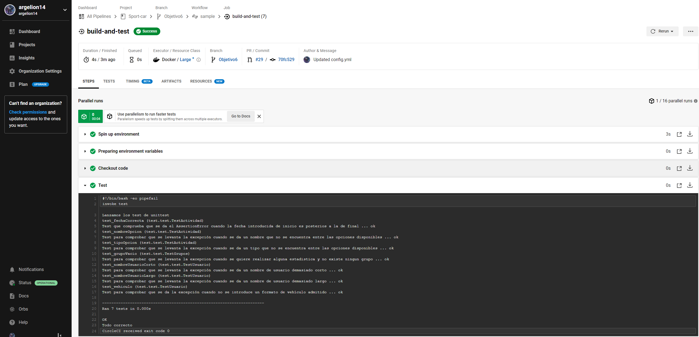

# Integración continua

Existen numerosos sistemas de integración continua, con los cuales se busca para este objetivo pasar los test, en diferentes ambientes, automaticamente, ejecución de los test en las diferentes versiones de Python con cada subida al repositorio de Github.

Se establecen así una serie de requisitos mínimos que tienen que tener estos sistemas de integración continua:
* Poder probar distintas versiones de nuestro lenguaje, que sea operativo en diferentes ambientes.
* Que pueda correr Python.
* Que el sistema se integre con nuestro repositorio de github.
* Que sea un sistema actualizado y que se use en la actualidad para proyectos similares.
* Que sea gratuito, pues es un proyecto educativo que pretende enseñar y que se aprendan conceptos de desarrollo ágil.
* Fácil de implementar, sin necesidad de realizar una instalación en un servidor, todo desde la nube.
* Soporte para docker.

Nos centraremos en la versión 3.8 de python pues es de las versiones más utilizadas hoy día.

Se quiere también testear en la última versión, la 3.10, como es lógico y siguiendo [buenas prácticas](https://blog.sqreen.com/top-10-python-security-best-practices/), y siguiendo la lógica testearemos en las versiones intermedias, la 3.9.

Se han tenido en cuenta así: 
[Travis](https://travis-ci.org/), 
[Semaphore CI](https://semaphoreci.com/), 
[Azure](https://azure.microsoft.com/es-es/), 
[Circle ci](https://circleci.com/), 
[Github Actions](https://github.com/argelion14/Sport-car/blob/Objetivo6/.github/workflows/testear.yml)

* [X] Especificar por que se testea cada versión
* [X] En un CI usar varios ambientes/versiones del lenguaje utilizado
* [X] En cada una, aplicar los test

Comenzamos probando con los sistemas mencionados en la documentación de la asignatura como son github action o los servicios freemiun, Circle CI o Semaphore CI.

### Github Actions

Realizamos una github action para pasar los test del repositorio cuando sea necesario.

Para configurar la herramienta de integración continua, lo primero y como hicimos en nuestra action que contruia el docker y lo subía a Dockerhub será especificar cuando se ejecutará la tarea, en este caso cuando se modifique algún archivo de código o de test. En este caso [sport-car](https://github.com/argelion14/Sport-car/tree/Objetivo6/sportcar) y [test](https://github.com/argelion14/Sport-car/tree/Objetivo6/test).

Configuraremos el job para que ejecute los test en diferentes versiones de Python
 

Ha resultado ser fácil de implementar, trabaja con diferentes versiones de python para ver como se comporta nuestro proyecto en diferentes ambientes, se integra completamente con github y es gratuito, una buena herramienta para realizar CI en nuestro proyecto.

La documentación seguida puede consultarse [aquí](https://github.com/actions/starter-workflows/blob/main/ci/python-package.yml)

### Circle CI

Para la configuración de Circle CI, nos registramos y desde el primer momento nos damos cuenta que esta muy relacionada con github, nos permite elegir nuestro proyecto desde la propia web y realizar un documento de configuración en nuestra rama dandonos una base, en este caso se elige nuestro lenguaje python.

A continuación se edita la configuración y ponemos nuestros parametros, pondremos nuestra imagen docker, como máquina donde se ejecutaran los test siendo esta, que testea la version *3.10-slim-bulleye* de python, que era la que probaba nuestra contenedor.

A continuación se muestra el correcto funcionamiento de los test con nuestra herramienta de integración continua:

Pese a toda la facilidad de uso que implicaba, no se consideró pues me daba error en diferentes pruebas y tarde mucho en conseguir subsanar el error(solo se encontró lo que suponía el error) lo que implica posibles problemas a la larga.

Este error se debe a que ya no se da [soporte](https://github.blog/2021-09-01-improving-git-protocol-security-github/#libgit2-and-other-git-clients) a partir del dia 11 es decir llego justo, por lo que ya no me funciona. No es compatible con SHA-2.

### Azure pipelines

Una vez nos registramos en el sitio oficial con nuestra cuenta de github, después de darle permisos, empezaremos a trabajar con Azure DevOps.

Seleccionaremos nuestro repositorio sport-car, y luego seleccionaremos nosotros el YAML file pues queremos trabajar desde nuestra rama.

Siguiendo la [documentación oficial](https://docs.microsoft.com/es-es/azure/devops/pipelines/ecosystems/python?view=azure-devops) desarrollamos el yml.

Este nos da fallo debido a que necesitamos una licencia para lanzar pruebas en paralelo.

Tras un tiempo ya si tenemos permisos al realizar un cuestionario que no sale en la web, conseguimos ejecutar los jobs y comprobar como se ejecutaban los test, todo ello en sincronización con github.

Azure ha sido una herramienta que pese, tener que enviar un formulario para empezar a trabajar ha sido sencilla de usar desde un principio y perfectamente integrada con github, por la que no se descarta como posible herrmienta de CI del proyecto, también destacar todo el proceso ha sido gratuito.

La documentación seguida [aquí](https://docs.microsoft.com/es-es/azure/devops/pipelines/?view=azure-devops).

### Semaphore CI

Se ha prescindido de esta debido a la pequeña prueba de 14 dias que ofrece.

### Travis

Vamos a utilizar el mes gratuito que ofrece, que aunque insuficiente para testear nuestra aplicación veremos como funciona. Realizaremos un Trigger build y conseguiremos realizar los test como se muestra con una configuración sencilla.

Configuración:

Una herramienta sencilla de usar, pues aporta mucho con su Trigger build.

#### Elección final

Se ha decidido descartar Semaphore CI y Travis por su condición de ser herramientas de CI de pago que ofrecen un servicio gratuito, en especial Travis se trabajó, y aunque resulte ser fácil de usar se terminó por dejar de usar por ser un pruba de un mes.

También se ha descartado Circle CI debido a problemas al clonar el repositorio de github a partir del 11 de Enero de 2022. [(+info)](https://github.blog/2021-09-01-improving-git-protocol-security-github/#libgit2-and-other-git-clients)

Por ello las elecciones han sido **Github Action**, una herramienta que sirve para CI en nuestro proyecto, muy simple y la mejor integrada con github, y **Azure pipelines** otra herramienta que, nos permite probar python en diferentes ambientes, de una manera sencilla con un archivo de configuración azureCI.yml.